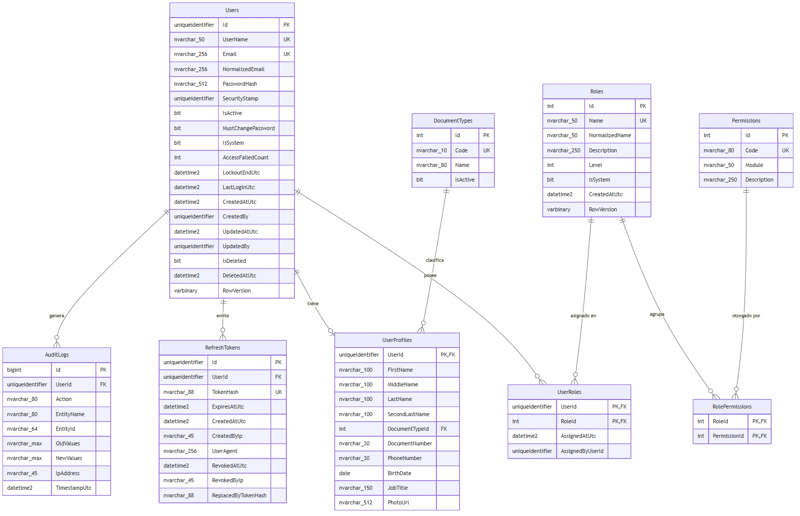
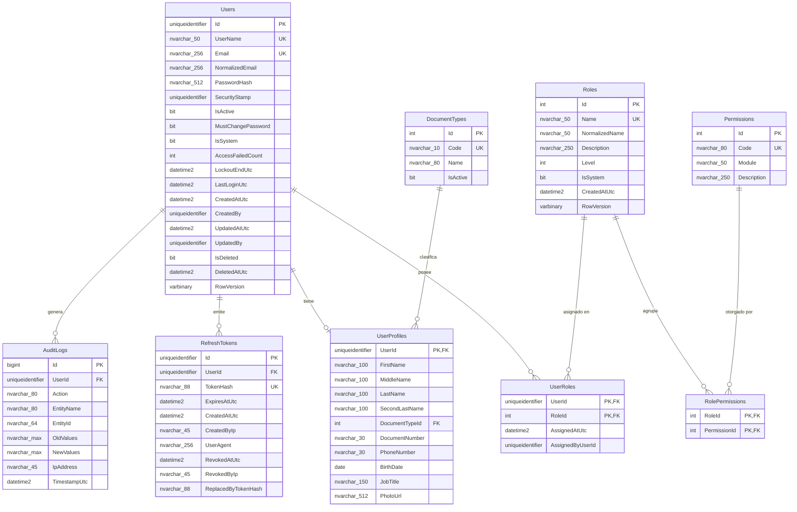

# Modelo entidad-relación

Sistema de usuarios y roles de FyM Technology. Base de datos: SQL Server 2022, mapeada con Entity Framework Core 8 (Code First). El script SQL generado desde las migraciones está en [`schema.sql`](./schema.sql).

## Diagrama

Versión editable (Mermaid) — se renderiza automáticamente en GitHub/GitLab y en la mayoría de visores de Markdown:

## Racional de diseño

### ¿Por qué separar `Users` de `UserProfiles` en lugar de una sola tabla?

1. **Separación de responsabilidades.** `Users` es la identidad de seguridad (credenciales, estado de bloqueo, sello de seguridad). `UserProfiles` es información demográfica. Cambian por razones y a ritmos distintos: un cambio de teléfono no debería tocar la misma fila que gobierna la autenticación.
2. **Superficie de exposición mínima.** Las consultas de autenticación (login, validación de token) solo necesitan `Users`; nunca cargan datos personales innecesarios. Menos I/O y menor riesgo de fuga accidental en proyecciones.
3. **Vía de extensión hacia facturación electrónica.** El perfil es la parte del modelo que crece por necesidades de negocio. Si el sistema se usara para facturación electrónica, se añadiría una tabla `BillingProfiles` en relación 1:1 con `Users` (tipo de persona, NIT + dígito de verificación, razón social, régimen y responsabilidades fiscales, dirección fiscal con catálogos de país/departamento/ciudad, correo de facturación) **sin tocar la tabla de identidad ni sus índices**. Esta tabla no se implementó en esta entrega por estar fuera del alcance solicitado, pero el modelo está preparado para incorporarla sin migraciones destructivas.
4. **Columnas nulas.** Casi todo el perfil es opcional; mantenerlo aparte evita una tabla `Users` ancha y llena de `NULL`.

### ¿Por qué `Users`↔`Roles` es N:M y no un `RoleId` en `Users`?

Un usuario puede necesitar más de un rol (por ejemplo, Admin + un rol de auditoría a futuro) sin rediseñar el esquema. El costo es una tabla de unión (`UserRoles`), a cambio de flexibilidad real.

### ¿Por qué existe `Permissions` además de `Roles`?

Autorizar comparando el nombre del rol en código (`if role == "Admin"`) obliga a recompilar y desplegar cada vez que cambian las reglas de acceso. Autorizando por **permiso** (`users.create`, `roles.delete`, …) y componiendo permisos dentro de un rol vía `RolePermissions`, crear un rol nuevo con una combinación de permisos distinta es un `INSERT`, no un despliegue. Los permisos del usuario viajan como claims dentro del JWT, así que autorizar una petición no requiere ninguna consulta adicional a la base de datos.

### ¿Por qué `Roles.Level`?

Un entero jerárquico (`SuperAdmin` = 100, `Admin` = 50, `User` = 10) permite expresar la regla del enunciado — *"el Admin puede hacer todo el CRUD salvo alterar al Super Administrador"* — como una comparación numérica genérica (`UserAccessPolicy.EnsureCanModify`), en vez de un `if (rol == "SuperAdmin")` disperso por cada endpoint. Cuando se crea un rol nuevo con nivel intermedio, la regla sigue funcionando sin tocar código.

### ¿Por qué `RefreshTokens` vive en la base de datos?

Permite revocación real (logout, cambio de contraseña, desactivación de la cuenta) y rotación con detección de reuso: cada token nuevo reemplaza al anterior (`ReplacedByTokenHash`), y si un token ya rotado vuelve a presentarse, se interpreta como robo de sesión y se revoca toda la familia. Solo se persiste el **hash SHA-256** del token, nunca el valor en claro — una fuga de la base de datos no permite reconstruir sesiones activas.

### ¿Por qué `AuditLogs` es de solo escritura y no referencia en cascada a `Users`?

Un registro de auditoría debe sobrevivir a la eliminación lógica del usuario que lo generó (`DeleteBehavior.Restrict`); es evidencia histórica, no un dato operativo que deba desaparecer con su dueño.

## Índices y restricciones

| Índice / restricción | Tabla | Motivo |
|---|---|---|
| `IX_Users_Email` (único, filtrado `WHERE IsDeleted = 0`) | Users | Permite reutilizar el correo de una cuenta eliminada lógicamente |
| `IX_Users_UserName` (único, filtrado `WHERE IsDeleted = 0`) | Users | Ídem para el nombre de usuario |
| `IX_UserProfiles_Document` (único, filtrado `WHERE DocumentTypeId/DocumentNumber IS NOT NULL`) | UserProfiles | Un mismo documento no puede repetirse cuando está informado |
| `IX_RefreshTokens_TokenHash` (único) | RefreshTokens | Búsqueda O(1) al validar un refresh token |
| `IX_RefreshTokens_UserId_ExpiresAtUtc` | RefreshTokens | Acelera la revocación masiva de tokens activos de un usuario |
| `IX_UserRoles_RoleId` | UserRoles | La PK compuesta `(UserId, RoleId)` ya cubre `UserId`; este índice cubre el sentido inverso (roles → usuarios) |
| `IX_AuditLogs_TimestampUtc` (descendente) | AuditLogs | Los listados de auditoría siempre ordenan por fecha reciente primero |
| `Users.RowVersion` / `Roles.RowVersion` (token de concurrencia) | Users, Roles | Concurrencia optimista: una escritura sobre una fila modificada mientras tanto devuelve `409 Conflict` en vez de pisar el cambio. El token se genera en el interceptor de EF Core (no como `rowversion` nativo de SQL Server) para que el mismo modelo funcione igual contra cualquier proveedor relacional |
| Filtro global de consulta `WHERE IsDeleted = 0` | Users | Aplicado automáticamente por EF Core (`HasQueryFilter`) a toda consulta sobre `Users`, salvo que se pida explícitamente lo contrario |

**Borrado en cascada:** `UserProfiles`, `UserRoles` y `RefreshTokens` se eliminan en cascada junto con su `User` (`DeleteBehavior.Cascade`). `AuditLogs` usa `DeleteBehavior.Restrict` por la razón explicada arriba. En la práctica, los usuarios nunca se borran físicamente (ver "Eliminación lógica" abajo), así que la cascada solo aplica en escenarios de limpieza administrativa directa sobre la base de datos.

## Eliminación lógica (soft delete)

`Users.IsDeleted` + `Users.DeletedAtUtc`. El endpoint `DELETE /api/v1/users/{id}` nunca ejecuta un `DELETE` en SQL: marca la fila como eliminada y desactivada. Esto preserva la integridad referencial con `AuditLogs` y `RefreshTokens`, y permite auditar quién existió en el sistema.

## Datos sembrados (`DatabaseSeeder`, idempotente)

- **`DocumentTypes`**: CC, CE, TI, NIT, PAS.
- **`Permissions`**: catálogo cerrado de 14 permisos (`users.*`, `roles.*`, `audit.read`, `profile.*`) definido en código (`PermissionCode`), no editable desde la API.
- **`Roles`**: `SuperAdmin` (nivel 100, todos los permisos), `Admin` (nivel 50, todos los permisos salvo `roles.delete` y `audit.read`), `User` (nivel 10, solo `profile.read-own` y `profile.update-own`). Los tres son roles del sistema (`IsSystem = true`): no se pueden eliminar, aunque sus permisos sí son editables.
- **Super administrador precreado**: usuario `IsSystem = true` con el rol `SuperAdmin`, con credenciales tomadas de configuración (`Seed:SuperAdmin:*`, sin valores por defecto en código — deben llegar por variable de entorno). El seeder nunca sobreescribe la contraseña de un super administrador ya existente.

## Diccionario de datos (columnas no evidentes por su nombre)

| Tabla.Columna | Descripción |
|---|---|
| `Users.SecurityStamp` | GUID que se rota al cambiar la contraseña, los roles, o desactivar la cuenta. Viaja como claim `sstamp` en el JWT; si no coincide con el valor en base de datos, el token se rechaza aunque no haya expirado. |
| `Users.IsSystem` | Marca cuentas precreadas (el super administrador) que no pueden eliminarse. |
| `Users.RowVersion` | Token de concurrencia optimista, ver tabla de índices. |
| `Roles.Level` | Nivel jerárquico usado por `UserAccessPolicy` para decidir quién puede operar sobre quién. |
| `Roles.IsSystem` | Roles sembrados (`SuperAdmin`, `Admin`, `User`): no se eliminan ni cambian de nivel, pero sus permisos sí se pueden editar. |
| `RefreshTokens.TokenHash` | Hash SHA-256 en Base64 del refresh token. El valor en claro nunca se persiste. |
| `RefreshTokens.ReplacedByTokenHash` | Enlaza un token revocado con el que lo reemplazó en la rotación; permite detectar reuso. |
| `AuditLogs.OldValues` / `NewValues` | JSON con el estado de la entidad antes/después del cambio, excluyendo siempre `PasswordHash`, `SecurityStamp` y `RowVersion`. |
